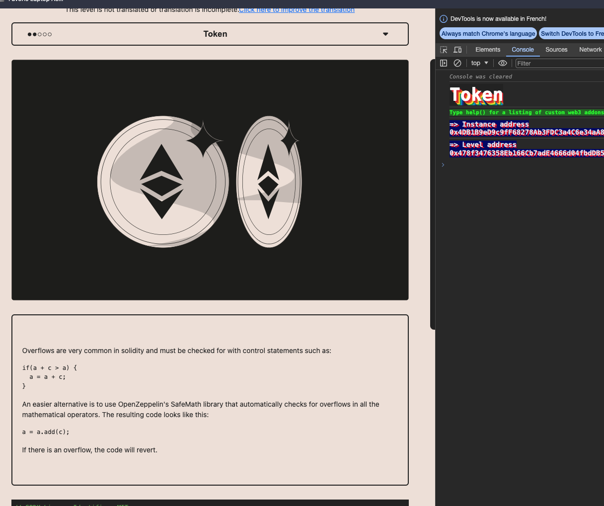
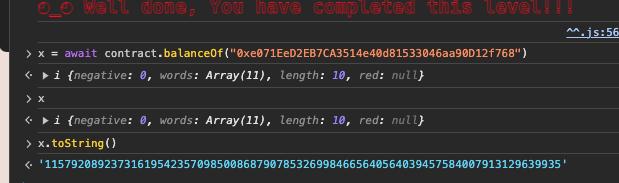
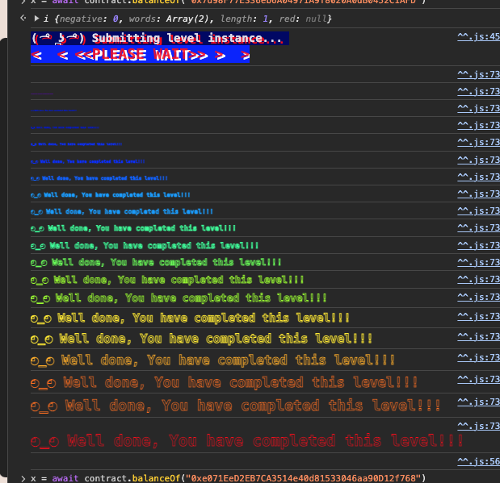

<!-- @format -->
# English README　[Jump to Japanese Version](#japanese)

# Ethernaut Solutions
- The Ethernaut is a Web3/Solidity-based coding wargame, played in the Ethereum Virtual Machine. 
- Each level is a smart contract that needs to be 'hacked'.

Here are the writeups of my solutions levels I cleared. 
** I will not recommend you to look at solutions I wrote. Solve it yourself for your learning 😛 **

# How to use Ethernaut
- To use ethernaut, you need to use the console from the developper tool of your browser in the first place.
- If your confortable with Foundry and Methods call using `cast` and `send`, you can also solve problem from Foundry framework.
- If you are not confortable yet with ABI, then it is a great way to learn about it and how to call any contract by external calls.
- In higher difficulty levels, you will need to wrote smart contracts and interfaces to hack some smart contract externally for clearing levels.

## Ethernaut 5. Token

The goal is get all ERC20 Tokens of the contract transfered to our balance
- The trick in that contract is that it is done under `Solidity 0.6.0`. under `0.8.0` we need to use a library called `SafeMath` for dealing with numbers.
- Without `SafeMath` all solidity contracts with a compiler version under `0.8.0` have an `underflow` and `overflow` problem.
- Example: We have an integer of type `uint` with value of `20`. Let say we do `20 + 1`, we don't get `21`. Instead we get `1` by going over `21`. Which is the `UintMax` in this case.
- Meaning we can have all tokens of the total supply.
- SafeMath was used to prevent this problem. Since `0.8.0` it is integrated into solidity by default.

<br/>
<p align="center">

</p>
<br/>

1. Input the contract address in the `transfer` function, and the number `21`

```bash
await contract.transfer("0x70147a35F3f84F7D4d7c8bA5a89648e3cFBDAA5C", 21)
```

2. Check the amount of token which has been sent from the contract to you

```bash
x = await contract.balanceOf("0xe071EeD2EB7CA3514e40d81533046aa90D12f768")

x.toString()
```

As you can see the `transfer()` function did not sent `21`　Tokens to you, but all of it。↓
<br/>
<p align="center">

</p>
<br/>

Level is completed.

<br/>
<p align="center">

</p>
<br/>

<a name="japanese"></a>
# 日本語版のREADME

# Ethernautの解決策
- Ethernautは、Web3/Solidityベースのコーディングウォーゲームで、Ethereum Virtual Machine (EVM) でプレイされます。
- 各レベルはハッキングする必要があるスマートコントラクトです。

これはクリアしたレベルの解決策です。
**解決策を見ることをお勧めしません。学習のために自分で解決してください 😛 **

# Ethernautの使用方法
- Ethernautを使用するには、まずブラウザの開発者ツールからコンソールを使用する必要があります。
- Foundryとcastおよびsendを使用した方法の呼び出しに慣れている場合、Foundryフレームワークから問題を解決することもできます。
- まだABIに慣れていない場合、それを使用して任意のコントラクトを外部呼び出しで呼び出す方法について学び、理解するのに最適な方法です。
- より高難度のレベルでは、スマートコントラクトとインターフェースを作成して、いくつかのスマートコントラクトを外部からハッキングするために解レベルをクリアする必要があります。

## Ethernaut 5. Token

目標は、コントラクトのすべてのERC20トークンを手に入れることです。
- このコントラクトのミソは、`Solidity 0.6.0` の下で行われたことです。`0.8.0` では、数値の処理に `SafeMath` と呼ばれるライブラリを使用する必要があります。
- `SafeMath` がない場合、コンパイラバージョンが `0.8.0` 未満のすべてのSolidityコントラクトには`アンダーフロー`と`オーバーフロー`の問題があります。
- 例：`uint` 型の整数で値が `20` の場合、`20 + 1` を行ったとしましょう。結果は`21` ではなく、`21` を超えて `1` を得ます。これはこの場合の `UintMax` です。
- つまり、合計供給量のすべてのトークンを持っている可能性があります。
- この問題を防ぐために `SafeMath` が使用されました。`0.8.0` 以降、Solidityにはデフォルトで組み込まれています。


<br/>
<p align="center">

</p>
<br/>


1. コントラクトのアドレスを入力して、21を入力する

```bash
await contract.transfer("0x70147a35F3f84F7D4d7c8bA5a89648e3cFBDAA5C", 21)
```

2. 自分のアドレスに送られたトークンの数を確認する

```bash
x = await contract.balanceOf("0xe071EeD2EB7CA3514e40d81533046aa90D12f768")

x.toString()
```

`transfer()`の関数をコールした時に`21　トークン`が転送されなかった。全てが自分に送られた。↓
<br/>
<p align="center">

</p>
<br/>

レベルが完了。

<br/>
<p align="center">

</p>
<br/>
